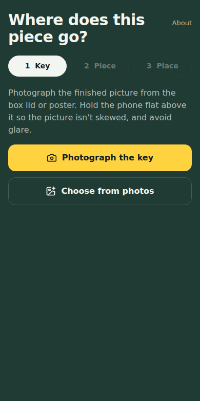

# Puzzle Piece Finder

Photograph a jigsaw piece and find where it belongs on the box art.
Runs entirely in the browser: no server, no account, no uploads.

**Live site:** https://johnb8005.github.io/puzzle-piece-finder/
**App:** https://johnb8005.github.io/puzzle-piece-finder/app/

<p align="center"></p>

## How to use it

1. **Key.** Photograph the finished picture on the box lid, hold the phone flat to avoid skew.
   Drag the corners so the crop hugs the picture, then enter the piece count
   (or the exact pieces across and down if the box lists them).
2. **Piece.** Lay one piece face up on plain paper that contrasts with it and photograph it.
   The app cuts the piece out from the background. A slider adjusts the cut-off.
3. **Place.** The app marks the spot on the key, shows a close-up, shows the piece turned the
   way it sits, and lists up to three candidate spots with a confidence verdict.

Everything is saved in the browser as you go. Close the tab and reopen the app and you are back
where you were, with the key, the grid, the last piece and its result. The **Puzzles** button lists
every saved puzzle so you can switch between them or delete one.

## How it works

All image processing is plain canvas pixel work in [`src/lib`](src/lib):

| Module | What it does |
| --- | --- |
| `segment.ts` | Reads the background colour from the photo's frame, thresholds by colour distance (Otsu), keeps the largest blob, fills holes, erodes the bevelled rim and straightens the piece using the peak of its edge-direction histogram. |
| `match.ts` | Slides the cut-out over a small copy of the key at every position, in four turns and three sizes, scoring zero-mean colour correlation minus a colour-drift penalty. The strongest peaks are re-scored on a 3× finer copy and the top three distinct spots are returned. |
| `grid.ts` | Derives pieces across / down from the piece count and the key's aspect ratio, and maps a match to a row and column. |
| `verdict.ts` | Turns the top scores into "Strong match", "Likely match" or "Several spots look alike". |
| `canvas.ts`, `stats.ts`, `draw.ts` | Canvas helpers, DOM-free numerics (median, Otsu) and the result-view drawing. |
| `session.ts`, `db.ts` | The saved-session model and its IndexedDB store. Photos are stored as JPEG Blobs; the id of the open session is in localStorage. Storage failures are swallowed so the app still works in private windows. |

The UI is React with a small set of components in `src/components` and one view per step in `src/steps`.

## Development

Requires [Bun](https://bun.sh) 1.2 or newer.

```sh
bun install
bun run dev        # landing page at http://localhost:5173/, app at /app/
bun run typecheck  # tsc --noEmit
bun test           # unit tests for the pure modules
bun run build      # production build to dist/
bun run preview    # serve dist/
bun run check      # typecheck + test + build, same as CI
bun run demo:gif   # re-record public/demo.gif (see below)
```

The camera button uses `capture="environment"`, which browsers only honour over HTTPS or on
localhost. To try it on a phone during development, use a tunnel or the "Choose from photos"
button instead.

### Re-recording the demo GIF

`scripts/record-demo.ts` draws a synthetic box-art scene and a jigsaw-shaped piece, runs the
built app through all three steps in headless Chromium and encodes the frames to
`public/demo.gif`. It needs a production build and a Chromium that playwright-core can find:

```sh
bunx playwright install chromium   # once; or set CHROMIUM_PATH to an existing binary
bun run build && bun run demo:gif
```

## Project layout

```
index.html            landing page
app/index.html        app entry
src/
  main.tsx            React bootstrap
  App.tsx             state and step orchestration
  theme.ts            palette, font and shared inline styles
  types.ts            Step and Crop types
  components/         Note, PhotoButtons, StepTabs, CropBox, Library
  steps/              KeyStep, PieceStep, ResultStep
  lib/                image processing (see above) and unit tests
  styles/             theme tokens, app CSS (Tailwind) and landing CSS
public/               favicon and the demo GIF
scripts/              demo GIF recorder
.github/workflows/    CI and GitHub Pages deployment
```

## CI and deployment

`.github/workflows/ci.yml` runs on every push and pull request: install with a frozen lockfile,
typecheck, unit tests and a production build. On pushes to `main` it also uploads `dist/` and
deploys it to GitHub Pages.

One-time setup in the repository settings: **Settings → Pages → Build and deployment → Source:
GitHub Actions**. After that every push to `main` publishes the site.

The build sets `BASE_PATH=/<repo name>/` so assets resolve under the project path. To host at a
custom domain or the root of a user site, build with `BASE_PATH=/`.
